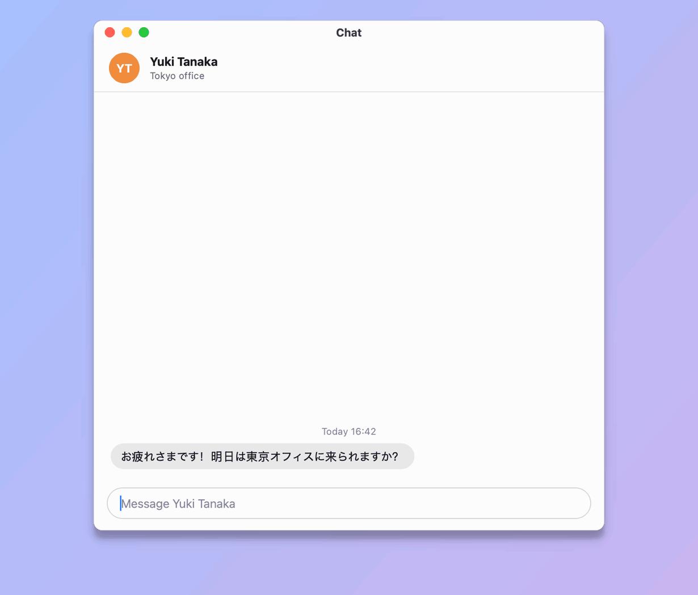
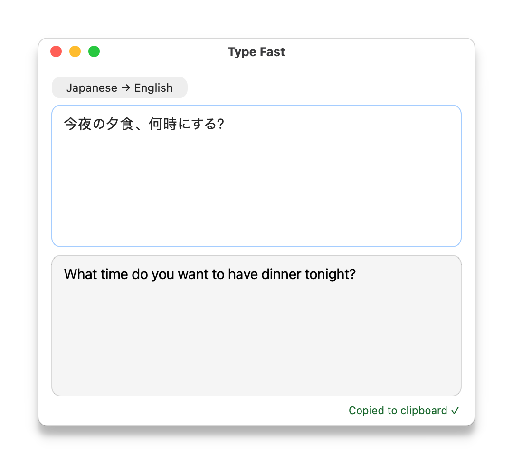
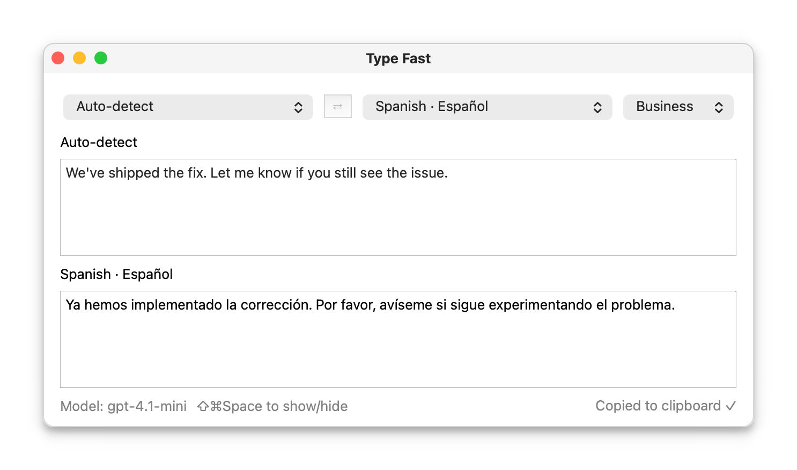

# Type Fast

**Type in one language. Get it in another — as you type.**

A tiny macOS translator that pops up with a hotkey, streams translations from
OpenAI or Azure AI Foundry, and copies the result for you.

<picture>
  <source media="(prefers-reduced-motion: reduce)" srcset="docs/images/demo.png">
  
</picture>

Press <b>⇧⌘Space</b> in any app, type, and press <b>⇧⌘Space</b> again to paste the translation.

## Features

- ⚡ **Live translation** — the translation streams in as you type; as you keep
  typing, finished lines aren't re-translated.
- ⌨️ **Spotlight-style hotkey** — press **⇧⌘Space** in any app to pop up a
  minimal window; press it again or **Esc** to go back.
- 🪟 **Stays out of your way** — the window is slightly see-through and fades
  further while you work in another app.
- 📋 **Auto-paste** — press the hotkey again and the finished translation is
  pasted into your app. It is on your clipboard too.
- 🌍 **16 languages + auto-detect** — English, Japanese, Chinese, Korean,
  Spanish, French, German, and [more](docs/usage.md#languages).
- 🎩 **Tone control** — Polite, Casual, Formal, Business, Friendly, Neutral, or
  your own custom instruction.
- 🔌 **OpenAI or Azure AI Foundry** — bring your own key and pick any model.

## Screenshots

<table>
  <tr>
    <td align="center" width="50%">
      
       <b>Summon anywhere</b> — a minimal popup with ⇧⌘Space
    </td>
    <td align="center" width="50%">
      
       <b>Pick a language and tone</b> — or let it auto-detect
    </td>
  </tr>
</table>

## Install

1. Download `Type-Fast-macos-arm64.zip` from the
   [latest release](https://github.com/wangx173/type-fast/releases/latest),
   unzip it, and drag **Type Fast.app** into `/Applications`. The prebuilt app
   requires an Apple Silicon Mac; on Intel Macs,
   [run from source](docs/development.md#run-from-source).
2. The app is ad-hoc signed, not notarized, so macOS blocks the first launch:
   - **macOS 15 and later:** open the app once, then go to **System Settings →
     Privacy & Security** and click **Open Anyway**.
   - **macOS 14 and earlier:** right-click the app → **Open** → **Open**.
3. Set your OpenAI API key in **Settings → Set OpenAI API Key…** (⌘,).

To use Azure AI Foundry instead, or to run from source, see
[Configuration](docs/configuration.md) and [Development](docs/development.md).

## Usage

Press **⇧⌘Space** in any app and type in the top box. The translation appears
below shortly after you pause, or right away when you end a sentence or press
Return. When it finishes, it is copied to the clipboard. Press **⇧⌘Space** to
go back to your app and paste it there (if the translation is still coming in,
it is pasted as soon as it finishes, if that is within 5 seconds and you don't
click or type first), or **Esc** to go back without pasting.
The first time, Type Fast asks you to allow it in **Accessibility** settings
so it can paste; see [Auto-paste](docs/usage.md#auto-paste).

| Shortcut                   | Action                                    |
|----------------------------|-------------------------------------------|
| **⇧⌘Space**                | Show Type Fast, or hide it and paste      |
| **Esc**                    | Hide the window without pasting           |
| **⌘L**                     | Show the language and tone pickers        |
| **⌘,**                     | Set your OpenAI API key                   |

The **Settings** menu also lets you change the model, the hotkey, the window
transparency, and the custom tone, and turn auto-paste off. See the [usage guide](docs/usage.md) for
details.

## Documentation

| Guide                                    | What's inside                                            |
|------------------------------------------|----------------------------------------------------------|
| [Usage](docs/usage.md)                   | Window layouts, hotkey, auto-paste, languages, and tone  |
| [Configuration](docs/configuration.md)   | API keys, Azure AI Foundry, models, and saved settings   |
| [Development](docs/development.md)       | Run from source, run tests, and build the `.app`         |

## Roadmap

- Store the API key in the macOS Keychain instead of a key file.
- Sign and notarize the app with a Developer ID.
- A menu-bar wrapper (and hiding the Dock icon).

## License

[MIT](LICENSE) © Xiang Wang
